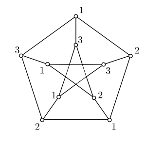
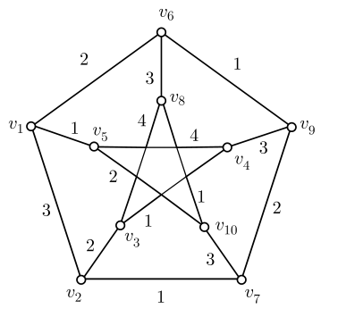

# 图论

    author：liano

## 图的基本概念

### 顶点度数

##### 定理 1.1（Euler）

> 任给无向图 G，有：
> $$
> \sum_{v\in V(G)} \deg{(v)}=2\varepsilon (G)
> $$

##### 推论 1.1

度数为奇数的顶点个数为偶数

### 路径与连通

##### 定义 1.7

边不重复的路径称为**行迹**

顶点不重复的路径称为**轨道**

起点与终点相同的路径称为**回路**

除了起点与终点相同之外, 没有相同顶点的回路称为**圈**

##### 定理 1.2

> 图 G 是二分图, 当且仅当 G 中无奇圈

$\Rightarrow $
反证法

$\Leftarrow $
任取 $u_0 ∈ V (G)$, 定义
X = {u|u ∈ V (G), 且 $\text{dist}(u_0, u)$ 为偶数}，Y = {u|u ∈ V (G), 且 $\text{dist}(u_0, u)$ 为奇数}.

用反证法，若存在 u, v ∈ X，u 与 v 在 G 中相邻, 证明 G 中有奇圈

##### 例：

> 设 G 是简单图，$\delta (G) \ge 2$, 则 G 中含圈

设 $P(u, v) = v_0(= u)v_1\cdots v_k(= v)$ 是 G 中最长的轨道。

因为 $\deg(u) \ge \delta(G) \ge 2$，除 $v_1$ 外, u 在 G 中至少还有一个相邻的顶点, 设为 w。
若 w 不在 $P(u, v)$ 上，$P(u, v)$ 加上边 wu 就是 G 中比 $P(u, v)$ 还要长的轨道，与$P(u, v)$ 是最长轨道矛盾。

因而 w 在 $P(u, v)$ 上，设 $w = v_i(i \ne 0, 1)$，则 $P(u, v)$ 上的一段轨道 $P(u, v_i)$ 加上边 uvi 就是 G 中的圈. 证毕.

### 有向图

##### 定理 1.3

> 任给有向图 G，有
> $$
> \sum \deg^+(v)=\sum \deg^-(v)=\varepsilon(G)
> $$

### 最短路径

#### Dijkstra 算法

$S$ 记录已经找到最短路径的顶点，每次计算 $u$ 通过上一次加入 $S$ 中的顶点 $u_i$ 为中转到达 $V-S$ 中顶点 $v$ 的路径长度，若小于现有路径，则 $d(v)=d(u_i)+w(u_i,v),\  l(v)=u_i$,更新一轮后找当前 $u$ 到 $V-S$ 最短路径，对应顶点加入 $S$

## 树

### 基本概念

##### 定理 2.1

> G 是树 $\Leftrightarrow$ 任意两顶点间有且仅有一条轨道$\Leftrightarrow $
> 不含圈且 $\varepsilon=\nu-1$ $\Leftrightarrow $ 
> 连通图且 $\varepsilon=\nu-1$ $\Leftrightarrow $
> 连通图，删掉任意一条边不连通  $\Leftrightarrow $ 
> 无圈图，加上任意一条边恰好有一个圈

##### 定义 2.2

设图 $G = (V, E)$ 是连通图, 任取 $v \in V$ , 称 $l(v) = max\{dist(u, v)|
u \in V \}$ 是顶点 v 的离心率, 称 $r(G) = min\{l(v)|v \in V \}$ 是图 G 的半径。

离心率恰好等于半径的顶点 v, 称为 G 的一个中心点, G 中全体中心点的集合称为 G 的中心.

> 每棵树的中心是由一个顶点或两个相邻顶点构成的

证明：一层一层地删叶子节点

### 生成树

##### 定理 2.3

> 连通图 $ \Leftrightarrow $ 有生成树

连通生成子图中边数最少的那个

##### 定理 2.4

> 设 $G$ 是连通图，$e\in E(G)$ 且不是环，则有
> $$
> \tau(G)=\tau(G-e)+\tau(G\cdot e)
> $$

计算过程中遇到环可以直接删掉，拆解到已经是一颗树时停止(平凡树也是树)，$\tau(T)=1$

##### 定理 2.5

> $$
> \tau(K_n)=n^{n-2}
> $$

不考虑同构的结果

### 最小生成树

#### Kruskal 算法

在不形成圈的前提下，每次选择权值最小的边，直到选出 $\nu -1$ 条边

#### Prim 算法

分两个阵营，$V^{'}$ 是已经加入过的顶点，每次从 $(V^{'},\overline{V^{'}})$ 中选择权值最小的边，把对应顶点加入 $V^{'}$

#### 破圈法

找圈，删除权值最大的边

### 二叉树

##### 定义 2.6

入度为 1 出度不为 0 的顶点称为**内点**, 内点和根统称为**分支点**。

根的深度为 0, 称为第 0 **层**。

从根到 T 的任一顶点 v 的距离称为 v 的**深度** L(v), 深度的最大值称为**树高** h(T).

设 T 是一棵有根树, 若每个顶点的孩子都从左到右规定了次序，则称 T 是**有序树**。

若 T 的每个分支点都恰好有 r 个儿子, 则称 T 是 r 叉**正则树**。

若 T 是 r 叉正则树且每个树叶的深度都是树高，则称 T 是 r 叉**完全**正则树。

##### 定理 2.8

> T 是二叉树 $\Rightarrow $
>
> - 第 i 层最多 $2^i$ 个顶点
> - 深度为 h 的二叉树最多有 $2^{h+1}-1$ 个顶点
> - $n_0=n_2+1$ 叶子数等于非叶节点个数加一
> - 包含 n 个顶点的二叉树的高度至少为 $\log_2(n+1)-1$

##### 定义 2.9

设二叉树 T 有 t 片树叶 $v_1, v_2,\cdots, v_t$，其权值分别为 $w_1, w_2, \cdots, w_t$，T 的加权路径长度 定义为：$WPL(T)=\sum_{i=1}^{t}w_iL(v_i)$ 

给定一组权值相同的树叶, 加权路径长度最短的树称为最优二叉树

#### huffman 算法

将叶子按权值升序排列，每次选择最小的两个权值 $w_1,w_2$ 对应的叶子，创造一个权为 $w_1+w_2$ 的分支点，将这两个叶子连上去，序列中删去这两个叶子，插入分支点。重复至形成一颗树

##### 引理 2.1

> 给定 $w_1\leq w_2 \leq\cdots \leq w_t$ ，则存在一棵 Huffman 树，使得 $w_1,w_2$ 对应的顶点是兄弟，且这两个顶点在二叉树中的深度都等于树高。

##### 定理 2.9

> Huffman树是最优二叉树

##### 定义 2.10

在建立不等长编码时, 必须使得任何一个字符的编码都不是另一个字符的前缀, 这种编码称为**前缀码**.

## 图的连通性

### 顶连通度

##### 定义 3.1

对于简单图 $G$ 中不相邻的顶点 $u,v(u\neq v)$ ，若存在 $S\subseteq V(G)-\{u,v\}$  使得 $G-S$ 不连通，则 $S$  是一个 **uv-顶割集**，简称 uv-割集。

含顶点最少的 uv-割集称为最小 uv-割集, 其中的顶点数记为 $c(u, v)$，称为 u 与 v 在 G 中的顶连通度，简称为 **uv-连通度**。

##### 定义 3.2

给定连通简单图 $G$，若 $G − S$ 不连通，则称 $S$ 是 $G$ 的顶割集，简称割集。若一个割集中有 k 个元素, 则称之为 **k-顶割集**。

含顶点数最少的割集称为最小割集，其中的顶点数记为 $\kappa(G)$, 称为 $G$ 的**顶连通度**, 简称为连通度。

对于非负整数 k 来说, 若 $\kappa(G) \geq k$, 则称 G 是 **k-连通**的。

约定完全图的连通度为 $\kappa(K_n) = n − 1$, 非连通图的连通度为 0。

除了 u, v 之外, P(u, v) 与 Q(u, v) 没有其他的公共顶点, 我们称这样的两条轨道为**无公共内顶的 uv-轨道**，记两两无公共内顶的 uv-轨道的最大数量为 $p(u,v)$

##### 定理 3.1（Menger）

> 给定简单图 G 中两个不相邻的顶点 u，v，有
> $$
> p(u,v)=c(u,v)
> $$

##### 定理 3.2 （Whitney）

> 任给简单图 G，有
> $$
> \kappa(G) = \min\{p(u, v)|u, v \in V (G), u\neq v\}.
> $$

### 扇形定理

##### 引理 3.1

假设简单图 G 是 k-连通图, 在 G 中增加一个新的顶点 y, 并且在 G 中任意选取至少 k 个顶点, 将 y 与这些选取的顶点各连一条边, 得到的图记为 H, 则 H 也是 k-连通图.

##### 推论 3.2

假设简单图 G 是 k-连通图, X, Y 是图 G 两个顶点子集, $|X| \geq k, |Y | \geq k$ 且 $X ∩ Y = \emptyset$, 则 G 中存在 k 条无公共顶点的 (X, Y )-轨道. 其中 (X, Y )-轨道指的是轨道的两个端点分属 X 与 Y , 而中间顶点不属于 $X ∪ Y$ .

(加两个辅助顶点 x 和 y 分别与 X 和 Y 连接，由引理 3.1 易证)

##### 推论 3.3 （扇形定理）

> 假设简单图 G 是 k-连通图, $x \in V (G), Y \subseteq V (G) − \{x\}$ 且 $|Y| \geq k$, 则 G 中存在从 x 到 Y 的 k-扇形.

一组 k 条起点为 x、终点为 Y 中 k 个不同的顶点, 且除了 x 之外无公共顶点的轨道称为从 x 到 Y 的 k-扇形

##### 定理 3.3 （Dirac）

> 设 S 是 k-连通图 G 中的 k 元顶点子集, $k \geq 2$, 则 G 中存在一个圈 C, 使得 S 中所有的顶点都在 C 上.

### 边连通度

同理

##### 定理 3.4 （Menger')

> 给定图 G 中两个顶点 u, v, G 中两两无公共边的 uv-轨道的最大数量等于最小 uv-边割集中的边数, 即
> $$
> p'(u,v)=c'(u,v)
> $$

##### 定理 3.5

> 设 G 是简单图，则有
> $$
> \kappa(G)\leq\kappa'(G)\leq\delta(G)
> $$

### 割顶，桥

##### 定义 3.5

若 {v} 是割集, 则称 v 是 G 的割顶

{e} 是边割集, 则称 e 是 G 的桥 (或割边)

##### 定理 3.6

> 设 G 是连通图，则：
>
> v 是割顶  $\Leftrightarrow $
> 存在 V (G) − {v} 的一个划分 U ∪ W 使得任给 u ∈ U, w ∈ W, v 在每一条从 u 到 w 的轨道上

##### 定理 3.7

> 设 G 是连通图，则：
>
> e 是桥  $\Leftrightarrow $
> e 不在任何圈上 $\Leftrightarrow $
> 存在 V (G) − {v} 的一个划分 U ∪ W 使得任给 u ∈ U, w ∈ W, e 在每一条从 u 到 w 的轨道上

## 平面图

### 平面图及平面嵌入

##### 定理 4.1

> 图 G 可嵌入平面 $\Leftrightarrow $ 可嵌入球面

因此多面体图都是平面图

##### 定理 4.2

> 设 v 是平面图 G 的顶点, 则存在 G 的一个平面嵌入, 使得 v 在这个嵌入的外部面上.

(每个平图恰有一个无界的面, 称为外部面)

先嵌入球面，设 z 是包含 v 的某个面内部的点，从 z 发出光线，投影所得平图

##### 定义 4.2

称面 f 与它的边界上的顶点和边是关联的. 若 e 是平图的桥, 则只有一个面和 e 关联; 否则有两个面和 e 关联. 称一条边分隔和它关联的面. 面 f 的度数 deg(f) 是和它关联的边数, 即 b(f) 中的边数

##### 定理 4.3

> 任给平面图 G，有
> $$
> \sum\deg{(f)}=2|E(G)|
> $$

##### 定理 4.4 (Euler)

> 设 G 是连通平图, 有 ν 个顶点, ε 条边, ϕ 个面, 则
> $$
> \nu-\varepsilon+\phi=2
> $$

归纳证明，去掉圈上的一条边

##### 推论 4.1

对于给定的连通平面图, 其所有平面嵌入有相同的面数.

##### 推论 4.2

若 G 是 $\nu \geq 3$ 的连通简单平面图, 则 $\varepsilon ⩽ 3\nu− 6$.

若 G 是连通简单平面图, 则 $\delta \leq 5$

$K_5,K_{3,3}$ 是非平面图

### 极大平面图

##### 定义 4.3

设 G 是 $ν \geq 3$ 的平面图, 若任给 $u, v \in V (G),\ uv \notin E(G)$ , G + uv 都不再是平面图, 则称 G 是极大平面图.

##### 定理 4.5

> $\nu\geq3$ 的极大平面图 $\Leftrightarrow$  平面嵌入每个面都是三角形 $\Leftrightarrow $ $\varepsilon=3\nu-6$

##### 定理 4.6

> $\nu\geq4$ 的极大平面图 $\Rightarrow $ $\delta\geq3$

## 匹配理论

### 定义

##### 定义 5.1

设 M 是图 G 的边子集, 且 M 的任意两条边在 G 中都不相邻, 则称 M 是 G 的一个**匹配**. M 中同一条边的两个端点称为在 M 中相配. M 中边的端点称为被 M 许配. 若 G 中所有的顶点都被 M 许配, 则称 M 是 G 的**完备匹配**. G 中边数最多的匹配称为 G 的**最大匹配**. 若 M 是 G 的最大匹配, 则称 M 中的边数 |M| 为 G 的**匹配数** , 记作 $\alpha(G) = |M|$.

##### 定义 5.2

设 M 是图 G 的匹配, $P = v_0e_1v_1e_2 \cdots e_kv_k$ 是 G 中的一条轨道(圈), 若 $e_1, e_2, \cdots , e_k$ 在 M 与 E(G) − M 中交替出现, 则称 P 是 G 中关于 M的交错轨道 (圈).

头和尾都没被匹配的交错轨道叫做 **可增广轨道**

##### 引理 5.1

> M 是 G 的最大匹配 $\Leftrightarrow $ G 中没有关于 M 的可增广轨道

### 二分图匹配

##### 定理 5.1 （Hall）

> G 是二分图，则
>
> 存在将 X 中顶点都许配的匹配 $\Leftrightarrow $ 任给 $S\subseteq X$ 都有 $|N(S)|\geq|S|$

N(S) 是与 S 中顶点相邻的顶点构成的集合, 简称为 S 的邻顶集合.

##### 推论 5.1

对于正整数 k > 0, k 次正则二分图 G (每个顶点都关联着 k 条边) 有完备匹配

##### 定义 5.4

设 G 是一个图, C 是其顶点集合的子集, 即 C ⊆ V (G), 若 G 中任意一条边都有一个端点属于 C, 则称 C 是 G 的一个覆盖. 若 C 是 G 的**覆盖**, 但 C 的任何真子集都不是 G 的覆盖, 则称 C 是 G 的**极小覆盖**. 若 C∗ 是 G 的覆盖, 且不存在 G 的覆盖 C, 使得 |C| < |C∗|, 则称 C∗ 是 G 的**最小覆盖**, 且称 |C∗| 是 G 的覆盖数, 记作 $\beta(G)$.

##### 引理 5.2

> 假设 C 是图 G 的覆盖, M 是图 G 的匹配, 则 $|C|\geq|M|$

若图 G 存在覆盖 C 和匹配 M, 使得 $|C| = |M|$, 则 C 是最小覆盖, M 是最大匹配.

##### 定理 5.2 （Konig）

> G 是二分图 $\Rightarrow $ $\alpha(G)=\beta(G)$

### 任意图的完备匹配

##### 定理 5.3 （Tutte）

> G 有完备匹配 $\Leftrightarrow $ $\forall S\subseteq V(G)$ 都有 $o(G-S)\leq |S|$

o(G) 表示 G 中奇片的个数

##### 定理 5.4 （Petersen）

> 无桥的三次正则图有完备匹配

### 最大匹配算法

##### 定义

G 是一个图, M 是 G 的一个匹配, u 是 G 的一个没有被 M 许配的顶点. 对于 G 的子图 T, 如果 T 是树, u ∈ V (T), 且满足任给 v ∈ V (T), T 中从 u 到 v 的轨道 (注: 树中任意两个顶点间的轨道唯一) 是交错轨道, 则称 T 是 G 中关于 M 的 **u-交错树**. 

若除了 u 之外, T 中所有的顶点均被 M 许配, 则称 T 为被 M 许配的 u-交错树; 否则, 除了 u 之外, T 中还有未被 M 许配的顶点, 设为 v, 则 T 中从 u 到 v 的轨道就是一个可增广轨道.

#### 交错树算法

给定一个 G 的匹配 M，和未被 M 许配的顶点 u，不妨假设 u ∈ X.

其实类似一个广度优先搜索，对于 U 中所有未被访问的顶点 x，在 Y 中找所有与 x 相连且未被匹配的边，加入 E'，对应顶点 y(要求未被访问) 加入 V，更新顶点前驱，标记访问；对于 V 中所有未被访问的顶点 y，在 X 中找所有与 y 相连且被匹配的边，加入 E'，对应顶点(要求未被访问)加入 U，更新顶点前驱，标记访问。

已访问指的是已经通过这个顶点散发出边，标记是为了保证生成的是树

中间有了可增广轨道或者无顶点可加时结束程序

最终得到 G 中关于 M 的 u-交错树 $T_u = (U, E^{'}, V )$

##### 结论

交错树算法结束时, 若 u-交错树中仅有一个没有被 M 许配的顶点 u, 则没有找到可增广轨道. 在这种情况下, 由算法可以得到如下的结论.

- $|U| = |V | + 1$
- $N_G(U) = V$

##### 引理 5.4

> u-交错树中仅有 u 未被许配 $\Rightarrow $ G 中不存在含 T 中任何顶点的可增广轨道

#### 匈牙利算法

1. 取 G 的一个初始匹配 M, 比如说 M = ∅. G′ ← G.
2. 若 G′ 为空, 或者 G′ 中顶点都被 M 许配, 算法停止; 否则转第 (3) 步.
3. 取 G 中没有被 M 许配的顶点 u, 搜索 u-交错树 T~u~, 若找到可增广轨道, 设为 P, 令 M ← M ⊕ E(P), 转第 (2) 步; 否则, 令 G′ ← G′ −V (Tu), 转第 (2) 步.

匈牙利算法的输出结果一方面是匹配 M, 同时也将图 G 划分为一些没有公共顶点的交错树和一个有完备匹配的子图. 每棵交错树上仅有一个顶点 (也就是根) 没有被 M 许配

##### 定理 5.5

匈牙利算法结果是最大匹配

## Euler 图与 Hamilton 图

### Euler 图

##### 定义 6.1

经过图 G 每条边的行迹称为 **Euler 迹**; 经过图 G 每条边的闭行迹称为 **Euler 回路**. 如果图 G 含有 Euler 回路, 则称 G 为 **Euler 图**.

##### 定理 6.1

> 设 G 是连通图，则有：
>
> G 是 Euler 图 $\Leftrightarrow $
> G 的每个顶点度数均为偶数 $\Leftrightarrow $
> G 可以表示成无公共边的圈之并

##### 推论 6.1

连通图 G 有 Euler 迹, 当且仅当 G 中最多有两个度数为奇数的顶点.

##### 定理 6.2

有向 Euler 图同理

#### Fleury 算法

从图中的一个顶点出发用深度优先方法找图的行迹, 每一步尽可能不使用剩余图的桥, 除非没有别的选择，最后输出图 G 的一条行迹

##### 定理 6.3

设 G 是无向 Euler 图, 则 Fleury 算法终止时得到的行迹是 Euler 回路.

#### 逐步插入回路法

从起点 v 开始向后走，避开走过的路，直到回到起点。若已经得到 Euler 回路，退出；否则将回路起点(终点)改写为回路中存在未被走过的边的端点，继续走。

### 中国邮递员问题

求无向加权图 G 中一条经过每条边至少一次的回路 C, 使该回路的权最小。

#### Edmonds-Johnson 算法

如果 G 是 Euler 图，则找 Euler 回路，退出；

否则，找奇度顶点集合 V，Dijkstra 算法求 V 中每对顶点间的最短路径，构造加权完全图 K，求 K 总权最小的完备匹配 M，将 M 中的边重复一遍得到 Euler 图 G*，找 Euler 回路

### Hamilton 图

##### 定义 6.2

经过图 G 每个顶点的轨道称为 **Hamilton 轨道**; 经过图 G 每个顶点的圈称为 **Hamilton 圈**,如果图 G 含有 Hamilton 圈, 则称这个图为 **Hamilton 图**.

规定平凡图是 Hamilton 图.

正十二面体是 Hamilton 图

至少一边是偶数顶点的矩形网是 Hamilton 图

Petersen 图(10个顶点的三次正则图)不是 Hamilton 图，但删掉任何一个顶点后是.

##### 定理 6.4

> 设 G 是 Hamilton 图 $\Rightarrow $ 
> 对 V (G) 的每个非空真子集 S, 均有 $\omega(G − S) \leq |S|$, 其中 $\omega$ 是连通片个数.

设 H 是 G 的 Hamilton 圈, 则对于 V (G) 的每个非空真子集 S, 均有 $\omega(H − S) \leq |S|$. 而 H − S 是 G − S 的生成子图, 因此 $\omega(G − S) \leq \omega(H − S)$. 定理得证.

##### 定理 6.5（Dirac）

> 设 G 是简单图, 且 $ν(G) \geq 3, \delta(G) \geq \frac{v(G)}{2}$, 则 G 是 Hamilton 图.

##### 引理 6.1

> 设 G 是简单图, u 和 v 是 G 中两个不相邻的顶点, 且
> $$
> \deg(u)+\deg(v)\geq v(G)
> $$
> 则 G 是 Hamilton 图 $\Leftrightarrow $ G + uv 是 Hamilton 图.

##### 引理 6.2

图 G 的闭包 c(G) 是唯一确定的。

G 的**闭包** c(G) 指的是用下述方法从 G 得到的一个图: 反复连接 G 中度数之和不小于 ν(G) 的不相邻顶点对, 直到没有这样的顶点对为止.

##### 定理 6.6

> 简单图 G 是 Hamilton 图 $\Leftrightarrow $ c(G) 是 Hamilton 图

##### 推论 6.3

设 G 是 $v(G)\geq 3$ 的简单图, 若 c(G) 是完全图, 则 G 是 Hamilton 图.

因为至少有 3 个顶点的完全图都是 Hamilton 图

##### 定理 6.7

> 设 $v(G)\geq 3$, 对 G 的任意一对顶点 u, v,
>
> 若 $\deg(u) + \deg(v) \geq ν(G)−1$, 则 G 有 Hamilton 轨道; 
> 若 $\deg(u)+\deg(v) \geq ν(G)$, 则 G 是 Hamilton 图

### 旅行商问题

求完全加权图 K 中权值最小的 Hamilton 圈（权值非负，可以有权值为 $\infty$ 的边）

#### 最近邻法

贪心算法，从顶点 v1 开始贪心地走，每次走向距离最近且未被访问的顶点，访问完所有顶点后回到 v1

边权函数满足三角不等式的条件下有：
$$
\frac{d}{d_0}\leq\frac{1}{2}(\lceil \log_2{n}\rceil+1)
$$

#### 最小生成树法

首先求出 G 的一个最小生成树 T，将 T 中各边都添加一条权值相同的平行边，得到 Euler 图 G*，求出一条 Euler 回路 C，从起点开始按顺序“抄近路”访问 G 中的顶点

边权函数满足三角不等式的条件下有：
$$
\frac{d}{d_0}<2
$$

#### 最小权匹配法

对最小生成树法的改进，生成 Euler 图时找 T 中度数为奇数的顶点集合 V，求 V 关于 G 的生成子图的最小完备匹配 M，将 M 中的边加入 T，得到 Euler 图 G* ，其他步骤同上

边权函数满足三角不等式的条件下有：
$$
\frac{d}{d_0}<\frac{3}{2}
$$

## 图的着色

### 顶点着色

##### 定义 7.1

图 G 的一个 **k-顶点着色** 是指把 k 种颜色分配给图G 的顶点, 使每个顶点都分配一种颜色; 若相邻顶点的颜色不同, 则称这种着色是一个 **正常 k-顶点着色**. 若图 G 有一个正常 k-顶点着色时, 称 G 是可 k-顶点着色的. 图 G 的**顶点色数**指的是使得图 G 可正常顶点着色的最少颜色数 k, 简称为色数, 记为 $\chi(G)$

简单性质：

- $1\leq\chi(G)\leq \nu$，等于 1 当且仅当为零图(无边)，等于 v 当且仅当为完全图

- $\chi(G)=2$ 当且仅当 G 为有边二分图

- $$
    \chi(C_\nu)=
    \begin{cases}
    2, &\nu\mathrm{是偶数}\\
    3，&\nu\mathrm{是奇数}
    \end{cases}
    $$

- 若 H 是 G 的子图，则 $\chi(H)\leq\chi(G)$

##### 定理 7.1

> $$
> \chi(G)\leq\Delta(G)+1
> $$

##### 定理 7.2

设 $\nu(\nu \geq 3)$ 阶连通图 G 不是完全图也不是奇圈, 则 $\chi(G) \leq \Delta(G)$.

Petersen 图的色数是 3

### 边着色

##### 定义 7.2

同理

简单性质：$\Delta(G)\leq\chi'(G)\leq\varepsilon(G)$

Petersen 图的边色数是 4.

##### 引理 7.1

若连通图 G 不是奇圈, 则存在一种 2-边着色, 使得所用的两种颜色在每个度数大于等于 2 的顶点处都出现, 即每个度数大于等于 2 的顶点所关联的边用到了这两种颜色.

##### 定义 7.3

设 C 和 C′ 是图 G 的两种 k-边着色, 如果 $\sum c(v)\leq\sum c'(v)$ ，则称 k-边着色 C′ 是对 C 的一个**改进**, 其中 c(v) 与 c′(v) 分别表示用 C, C′ 着色时顶点 v 关联的边中出现的颜色数. 不能再改进的 k-边着色称为**最佳 k-边着色**.

##### 引理 7.2

设 C 是图 G 的一个最佳 k-边着色. 如果存在一个顶点 v~0~ 和两种颜色 i 与 j, 使得 i 色不在 v~0~ 关联的边中出现, 但 j 色在 v~0~ 关联的边中至少出现两次, 则边导出子图 $G[E_i \cup E_j]$ 中含 v~0~ 的连通片是一个奇圈.

##### 定理 7.3

> G 是二分图 $\Rightarrow $ $\chi'(G)=\Delta(G)$

由引理 7.2 易证

##### 定理 7.4

> G 是简单图，则 $\chi'(G)=\Delta(G)或\Delta(G)+1$

实际上, Vizing 证明了比上述定理更一般的结论, 它对所有无环图都正确. 定义 G 中连接两个顶点的最大边数称为 G 的重数, 记为 $\mu(G)$. 

Vizing 定理的一般形式为: 若 G 是无环图, 则 $\Delta\leq\chi'\leq \Delta+\mu$

**排课表问题**

假设所有老师给所有班级共计上 l 节课, 而需要编制一张 p 课时的课表. 则 $p \geq \Delta$, 平均每一课时至少需同时开 l/p 节课, 因此在某一课时里至少需要 $\lceil l/p\rceil$ 个教室. 下面的引理和定理从理论上保证了在一张 p 课时的课表里总可以安排完 l 节课, 使得在一节课时里最多占用 $\lceil l/p\rceil$ 个教室.

##### 引理 7.3

设 M 和 N 是图 G 中两个无公共边匹配, 且 |M| > |N|, 则存在G 中两个无公共边的匹配 M′ 和 N′, 使得 $|M'|=|M|-1,\ |N'|=|N|+1,\ M'\cup N'=M\cup N$

简而言之就是可以平均化。

##### 定理 7.5

> G 是二分图，$p\geq\Delta$，则存在 G 的 p 个不相交的匹配，使得
> $$
> E(G)=\cup_{i=1}^{p}M_i
> $$
> 且对 $1\leq i\leq q$，有
> $$
> \lfloor\varepsilon/q\rfloor\leq |M_i|\leq\lceil\varepsilon/q\rceil
> $$

该定理说明任意两个匹配的边数最多相差 1

### 平面图着色

##### 定义 7.4

同理，面色数记作 $\chi_*(G)$

##### 定义 7.5

**对偶图**：对于平面图 G 的平面嵌入。面 f 变成顶点 f\*；对原图的每一条边，若在两个面的公共边界上，就对应于两个面对应顶点间的一条边，否则，对应于所在面对应顶点的一条环，得到图 G\*

简单性质：

- G* 是平面图，且是平面嵌入
- G 中的环对应 G* 中的桥，G 中的桥对应 G* 中的环
- G* 是连通的
- 同构图的对偶图不一定同构

##### 定理 7.6

> 设 G\* 是连通平面图 G 的对偶图, n\*, m\*, ϕ\* 和 n, m, ϕ 分别是 G\* 和 G 的顶点数、边数和面数, 则
>
> - n\* = ϕ, m\* = m, ϕ\* = n
> - $\deg_{G*}(f∗) = \deg_G(f)$

回忆：deg(f) 表示与面 f 相关联的边数

##### 定理 7.7

> 设 G 是连通的无环平面图, 则 
>
> G 是可 k-面着色的 $\Leftrightarrow $ 它的对偶图 G∗ 是可 k-顶点着色的.

利用平面图最小度数 $\delta(G) \leq 5$ 的性质, 可以很简单地证明任何平面图都是可 6-顶点着色的; 通过对顶点换色, 可以进一步证明任何平面图都是可 5-顶点着色的, 但是这一方法不能证明四色定理.

##### 定理 7.9（五色定理）

> 任何平面图都是可 5-顶点着色的.

## 有向图

### 有向图

对于一个有向图 D, 忽略每条有向边的方向, 得到的无向图 G 称为 D 的**底图**; 反之, 对于任意一个无向图 G, 给每条边指定一个方向, 得到的有向图 D 称为 G 的**定向图**

##### 定义 8.1

若 D 中存在有向边 (u, v), 则称 v 是 u 的外邻顶点, 称 u 是 v 的内邻顶点. 对于顶点 u , 分别用 $N_D^+(u)$ 和 $N_D^-(u)$ 表示 D 中 u 的所有外邻顶点和所有内邻顶点构成的集合,  简称 u 的**内邻集**和**外邻集**

### 有向图的连通性

##### 定义 8.2

设 D 是有向图, 若存在从 u 到 v 的有向路径, 则称 u **可达** v

若 D 中顶点互相可达，则 D 为**强连通**的；若 D 中任意两个顶点间可以有一方可达另一方，则 D 为**单向连通**的，若 D 的底图连通，则 D 为**弱连通**的

##### 定理 8.1

> D 是强连通有向图 $\Leftrightarrow $ D 中存在有向生成回路, 即存在含有 D 中所有顶点的有向回路.

##### 定理 8.2

> 连通无向图 G 可以定向成强连通有向图 $\Leftrightarrow $ G 中没有桥

##### 引理 8.1

若 D 单向连通, 则 $\forall S \subseteq V(D), S \neq \empty$, 都存在顶点 v ∈ S, v 可达 S 中所有的顶点.

对 S 归纳证明

##### 定理 8.3

> D 是单向连通有向图 $\Leftrightarrow $ D 中存在有向生成路径

### 竞赛图

有向图中最长有向轨道长度与其底图色数之间的关系

##### 定理 8.4

> 有向图 D 中含有长度为 $\chi(G)-1$ 的有向轨道, 其中 G 为 D 的底图.

完全图的定向图称为**竞赛图**，有边 (u, v) 表示 u 打败了 v

注意到 $\chi(K_\nu) = \nu$, 可以直接得到以下推论

##### 推论 8.1

> 每个竞赛图都有有向 Hamilton 轨道.

对竞赛图，总存在一个顶点, 从它出发, 最多两步即可到达其他任何一个顶点. 这样的顶点称为竞赛图中的**王**

假定从 u 到 v 的有向边 (u, v)表示 u 胜了 v, 此时我们记 u 得一分, v 得零分. 假设竞赛图中没有平局，则有下述结论

##### 定理 8.5

> 竞赛图中得分最多的顶点是王

王未必是唯一的，王不一定是得分最多的

##### 定理 8.6

> 竞赛图 D 中 u 是唯一的王 $\Leftrightarrow $ u 的得分是 $\nu− 1$.

若竞赛图中没有得分为 ν − 1 的顶点, 则至少有两个王，两个王得分不一定一样

### 有向 Hamilton 图

本节考虑没有环和重边的所谓 严格有向图 D

推论 8.1 表明, 每个竞赛图都包含有向 Hamilton 轨道. 如果竞赛图是强连通的, 则可以得出更强的结论

##### 定理 8.7

> 若 $\nu \geq 3$ 阶竞赛图 D 是强连通的 $\Rightarrow $ 
>
> 则 $\forall k(3 \leq k \leq \nu),\ \forall u\in V(D)$，存在包含 u 的 k 阶圈

由定理 8.1, 也可以得知, 竞赛图 D 是强连通图的充要条件是 D 是有向 Hamilton 图. 强连通竞赛图不仅有有向 Hamilton 圈, 而且有从 3 到 |V(D)| 各种长度的有向圈, 此即泛圈性质.

下面讨论一般有向图是有向 Hamilton 图的充分条件.

##### 定理 8.8

> $P(u_0, v_0)$ 是严格有向图 D 中的最长有向轨道 $\Rightarrow $ 
>
> 其长度 $|E(P(u_0, v_0))| \geq \max\{\delta^−, \delta^+\}$. 

其中, $\delta^−, \delta^+$ 分别为 D 的最小入度与最小出度

##### 推论 8.2

> 严格有向图中有长度大于 $\max\{\delta^−, \delta^+\}$ 的有向圈.

##### 定理 8.9

> 设 D 是 ν 阶严格有向图, 若 $\min\{\delta^−, \delta^+\}\geq\frac{\nu}{2}$, 则 D 是有向Hamilton 图.

## 网络流理论

### 网络与流函数

